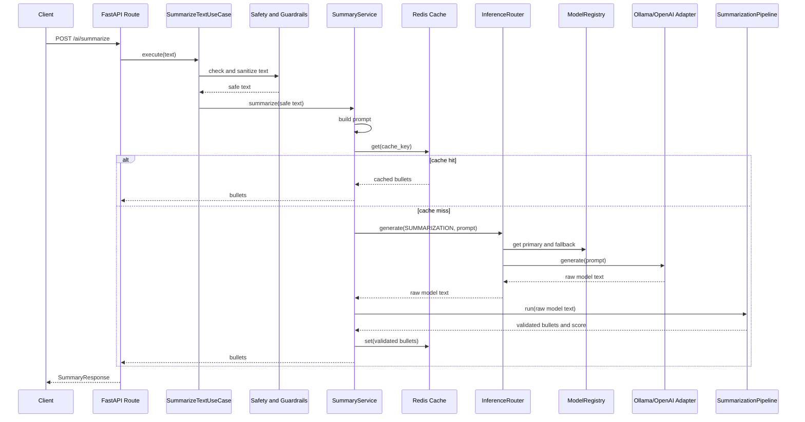

# AI Implementation Guide

This guide is your re-entry map for the AI part of the project.

Read this when you come back after a break and think:

> I remember I built this, but how does the AI flow actually work?

The short answer:

```text
POST /ai/summarize
-> FastAPI route
-> SummarizeTextUseCase
-> request safety + prompt guardrails
-> SummaryService
-> Redis cache lookup
-> InferenceRouter
-> ModelRegistry
-> Ollama/OpenAI adapter
-> SummarizationPipeline
-> validated bullets
-> Redis cache write
-> API response
```

## 1. What This AI Implementation Is Trying To Teach

This project is not only about calling an LLM.

It is about learning how to integrate AI into a backend service in a maintainable way.

The project teaches:

- how FastAPI routes should stay thin
- how use cases hold application workflow
- how services orchestrate AI-specific behavior
- how model providers can be hidden behind interfaces
- how to route by AI capability instead of vendor name
- how to use Ollama locally and OpenAI as another provider
- how to add cache, guardrails, validation, fallback, retries, and circuit breakers
- how to make AI requests observable with logs, request IDs, metrics, and traces

## 2. One-Page Mental Model

Think of the AI system as five layers.

```text
Layer 1: HTTP API
  Receives request and returns response.

Layer 2: Use Case
  Applies input protection and calls the AI service.

Layer 3: AI Service
  Builds prompt, checks cache, calls inference, validates output, writes cache.

Layer 4: Inference Infrastructure
  Chooses model provider, calls Ollama/OpenAI, handles fallback.

Layer 5: Reliability Pipeline
  Converts raw model text into trusted application output.
```

The important design idea:

> The route should not know which AI provider is used.

The route calls a use case. The use case calls a service. The service calls an inference port. The router and registry decide which model provider to use.

## 3. Folder Map

The AI implementation mostly lives here:

```text
app/application/ai/
  core/
    chat_pipeline.py
    summarization_pipeline.py
    pipeline_registry.py
    container.py
    circuit_breakers.py
    bullet_parser.py

  domain/
    ai_capability.py
    ai_model_port.py
    ai_inference_port.py
    ai_cache_port.py
    ai_pipeline_port.py
    ai_provider.py
    model_registry.py

  infrastructure/
    inference_router.py
    ollama_adapter.py
    openai_adapter.py
    redis_ai_cache.py

  prompts/
    summary_prompt.py

  schemas/
    ai_summary.py

  services/
    summary_service.py

  usecases/
    summarize_text.py

  validator/
    request/
      ai_guardrails.py
      ai_safety.py
    response/
      response_validator.py
      response_scorer.py
      hallucination_guard.py
```

FastAPI wiring lives here:

```text
app/routers/routes/ai.py
app/dependencies/ai_dependencies.py
app/main.py
```

Configuration lives here:

```text
app/core/config.py
```

Provider routing lives here:

```text
app/core/model_registry.py
```

## 4. The Actual API Entry Point

File:

```text
app/routers/routes/ai.py
```

Endpoint:

```http
POST /ai/summarize
```

Request:

```json
{
  "text": "FastAPI is a modern Python web framework..."
}
```

Response:

```json
{
  "bullets": [
    "FastAPI is a Python framework for building APIs.",
    "It supports async request handling.",
    "The AI layer adds provider routing and validation."
  ]
}
```

The route does very little:

```python
bullets = await use_case.execute(request.text)
return SummaryResponse(bullets=bullets)
```

That is intentional.

The route should only:

- receive HTTP input
- call the use case
- return the response schema

It should not know about Redis, Ollama, OpenAI, prompt building, or validation pipelines.

## 5. Dependency Injection: How FastAPI Builds The AI Objects

File:

```text
app/dependencies/ai_dependencies.py
```

This file connects FastAPI to the long-lived AI container:

```text
request.app.state.container
-> SummaryService
-> SummarizeTextUseCase
```

The container is created during app startup in:

```text
app/main.py
```

During startup:

```python
container = ServiceContainer(settings)
await container.startup()
app.state.container = container
```

This means each request can reuse:

- HTTP clients
- Redis client
- model adapters
- pipeline registry
- prompt builders
- guardrails

Without rebuilding everything every time.

## 6. Request Flow In Detail

### Step 1: FastAPI Validates Request Body

File:

```text
app/application/ai/schemas/ai_summary.py
```

Schema:

```python
class SummaryRequest(BaseModel):
    text: str = Field(..., min_length=1)
```

This catches missing or empty `text` before the AI workflow begins.

### Step 2: Use Case Applies Input Protection

File:

```text
app/application/ai/usecases/summarize_text.py
```

Workflow:

```text
raw user text
-> AISafetyFilter
-> AIGuardrails
-> SummaryService
```

The use case is the application boundary.

It knows the business action is "summarize this text", but it does not know which provider will run.

### Step 3: Safety Filter Blocks Sensitive Input

File:

```text
app/application/ai/validator/request/ai_safety.py
```

It rejects terms like:

- `credit card`
- `cvv`
- `password`
- `ssn`

This is a beginner-friendly safety layer. Later you can replace it with stronger PII detection.

### Step 4: Guardrails Sanitize And Limit Prompt Text

File:

```text
app/application/ai/validator/request/ai_guardrails.py
```

It handles:

- empty strings
- whitespace-only strings
- very large prompts
- binary/control characters
- whitespace normalization
- soft truncation

Important idea:

> Bad input should be rejected before you spend model time and money.

### Step 5: SummaryService Builds The Prompt

Files:

```text
app/application/ai/services/summary_service.py
app/application/ai/prompts/summary_prompt.py
```

The prompt builder converts safe user text into the final instruction sent to the model.

Example shape:

```text
Summarize the following text into EXACTLY 5 short bullet points.
Do not explain. Do not add extra text.

Text:
...
```

Prompt construction is separate so you can version and improve prompts later.

### Step 6: Redis Cache Lookup

File:

```text
app/application/ai/infrastructure/redis_ai_cache.py
```

The cache key includes:

- capability
- prompt
- model
- temperature
- max tokens

That means different model settings create different cache entries.

Flow:

```text
cache hit
-> return cached validated bullets

cache miss
-> call inference router
```

Important design:

> The project caches validated structured output, not raw model output.

### Step 7: InferenceRouter Selects Provider

File:

```text
app/application/ai/infrastructure/inference_router.py
```

The router does:

```text
get primary provider for capability
-> call primary provider
-> if primary raises AIProviderError
-> call fallback provider
-> return raw text
```

The service asks for:

```python
capability=AICapability.SUMMARIZATION
```

It does not ask for:

```text
ollama
openai
```

That keeps application logic independent from provider choice.

### Step 8: ModelRegistry Maps Capability To Provider

File:

```text
app/core/model_registry.py
```

The registry answers questions like:

```text
For summarization, what is the primary provider?
For summarization, what is the fallback provider?
```

Config example:

```env
AI__MODEL_REGISTRY__SUMMARIZATION__PRIMARY=ollama
AI__MODEL_REGISTRY__SUMMARIZATION__FALLBACK=openai
```

This means:

```text
try Ollama first
if Ollama fails, try OpenAI
```

### Step 9: Provider Adapter Calls Ollama Or OpenAI

Files:

```text
app/application/ai/infrastructure/ollama_adapter.py
app/application/ai/infrastructure/openai_adapter.py
```

Both adapters implement:

```text
AIModelPort
```

That means both expose:

```python
generate(prompt, temperature, max_tokens) -> str
```

Ollama uses local HTTP:

```text
POST /api/generate
```

OpenAI uses the OpenAI client.

Both adapters normalize provider failures into:

```text
AIProviderError
```

That is what allows the router to apply fallback consistently.

### Step 10: SummarizationPipeline Validates Model Output

File:

```text
app/application/ai/core/summarization_pipeline.py
```

The raw model response is not trusted.

Pipeline:

```text
raw model text
-> validate raw response
-> parse bullet lines
-> validate bullet list
-> hallucination guard
-> quality score
```

Only then does the API return the output.

## 7. Sequence Diagram



## 8. Key Design Patterns Used

### Ports And Adapters

Ports:

```text
AIModelPort
AIInferencePort
AIResponseCachePort
AIResponsePipeline
```

Adapters:

```text
OllamaAdapter
OpenAIAdapter
RedisAIResponseCache
```

Why:

> Application code depends on contracts, not provider-specific libraries.

### Registry Pattern

File:

```text
app/core/model_registry.py
```

Why:

> Capability-to-provider routing lives in one place.

### Pipeline Pattern

Files:

```text
summarization_pipeline.py
chat_pipeline.py
```

Why:

> Raw AI output needs deterministic validation steps before it becomes API output.

### Cache-Aside Pattern

File:

```text
summary_service.py
```

Why:

> Check cache first. On miss, call model and cache the validated result.

### Circuit Breaker Pattern

File:

```text
circuit_breakers.py
```

Why:

> Stop repeatedly calling unhealthy providers.

## 9. How To Debug When You Forget The Flow

Start here:

1. `app/routers/routes/ai.py`
2. `app/dependencies/ai_dependencies.py`
3. `app/application/ai/usecases/summarize_text.py`
4. `app/application/ai/services/summary_service.py`
5. `app/application/ai/infrastructure/inference_router.py`
6. `app/core/model_registry.py`
7. `app/application/ai/infrastructure/ollama_adapter.py`
8. `app/application/ai/core/summarization_pipeline.py`

If the API returns an error:

```text
400 / 422
-> check schema, safety filter, guardrails

413
-> check request body size or prompt size

500 with model route message
-> check AI__MODEL_REGISTRY__... config

502 AI provider failure
-> check Ollama/OpenAI adapter logs

502 invalid AI response
-> check response pipeline validation

slow response
-> check provider latency and cache misses
```

## 10. Important Logs To Search

Useful log messages:

```text
ai_cache_hit
ai_cache_miss
ai_router_primary_attempt
ai_router_primary_provider_failed
ai_router_fallback_attempt
ai_inference_started
ai_inference_completed
ai_inference_response_received
ai_circuit_prevented_request
```

Use `request_id` to follow one request across logs.

## 11. Configuration Cheat Sheet

Common AI config:

```env
AI__PROVIDER=ollama
AI__OLLAMA_BASE_URL=http://ollama:11434
AI__OPENAI_API_KEY=sk-replace-me
AI__REDIS_HOST=redis
AI__REDIS_PORT=6379
AI__OTLP_ENDPOINT=http://otel-collector:4317
AI__TEMPERATURE=0.6
AI__MAX_TOKENS=512
AI__TIMEOUT_SECONDS=40
AI__MAX_PROMPT_LENGTH=8000
AI__HARD_PROMPT_LIMIT=20000
AI__MAX_REQUEST_BYTES=262144
AI__MODEL_REGISTRY__SUMMARIZATION__PRIMARY=ollama
AI__MODEL_REGISTRY__SUMMARIZATION__FALLBACK=openai
```

## 12. How To Explain This In An Interview

Use this explanation:

> I built a FastAPI AI backend where the route is thin and delegates to a use case. The use case validates and sanitizes input before calling an AI service. The service builds the prompt, checks Redis cache, calls an inference router, and then validates the raw model output through a response pipeline. The inference router uses a model registry to choose the primary and fallback provider by capability, so summarization can use Ollama first and OpenAI as fallback. Provider adapters implement a common port, so the application does not depend directly on vendor APIs.

Short version:

> The model call is only one part. I also implemented guardrails, provider routing, fallback, caching, response validation, logging, and tracing.

## 13. How To Extend This With RAG Later

RAG can become a new capability:

```python
AICapability.RAG = "rag"
```

Suggested flow:

```text
POST /ai/rag/query
-> validate question
-> create embedding
-> retrieve top-k document chunks
-> build grounded prompt
-> call inference router
-> validate answer
-> return answer + sources
```

Suggested files:

```text
app/application/ai/schemas/rag.py
app/application/ai/usecases/query_knowledge_base.py
app/application/ai/services/rag_service.py
app/application/ai/prompts/rag_prompt.py
app/application/ai/core/rag_pipeline.py
app/application/ai/infrastructure/pgvector_store.py
```

Reuse existing ideas:

- request guardrails
- inference router
- model registry
- response pipeline
- logs and tracing
- provider adapters

## 14. Memory Hook

Remember this phrase:

> Route receives. Use case protects. Service orchestrates. Router selects. Adapter calls. Pipeline trusts.

That is the whole AI flow.
