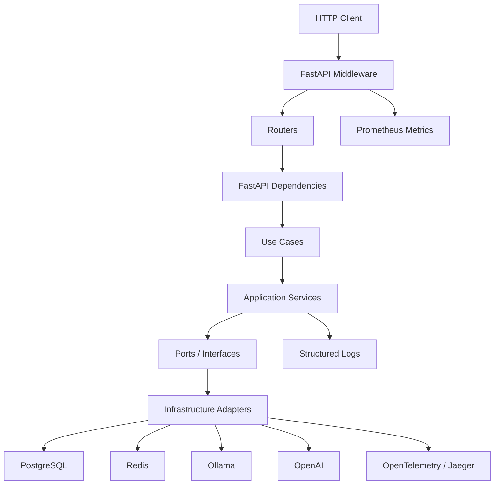
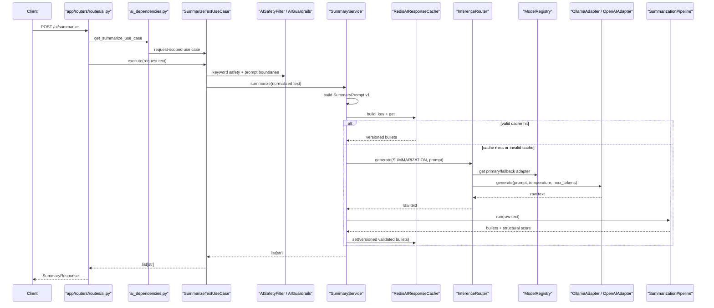
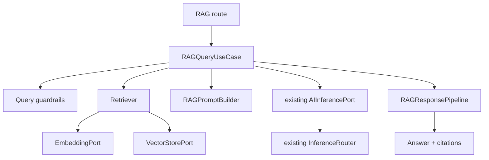
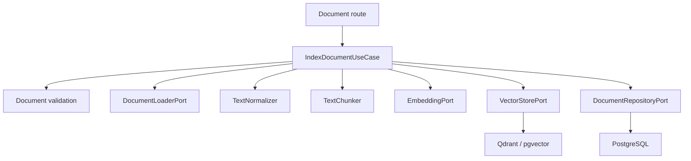

# RAG Readiness Assessment

Next architecture decision:

- `docs/architecture/adr/ADR-RAG-001-generic-rag-architecture.md`

## 1. Executive Summary

This repository is ready to begin RAG design work, but it should not add retrieval code directly into routes or provider adapters.

The existing project already has strong reusable backend foundations:

- FastAPI routing and dependency injection
- application use cases and services
- async SQLAlchemy repositories
- Redis-backed AI cache abstraction
- provider-independent text generation through `AIInferencePort`
- `InferenceRouter`, `ModelRegistry`, Ollama and OpenAI adapters
- retries, timeouts, provider fallback, and circuit breakers
- response pipeline concepts
- safe application exceptions
- structured logging, request IDs, Prometheus HTTP metrics, OpenTelemetry, and Jaeger

The major RAG gaps are separate and expected:

- no document domain model
- no document ingestion lifecycle
- no text extraction or chunking
- no vector store boundary
- no Qdrant or pgvector implementation
- no retriever
- no RAG prompt builder
- no citation-aware response contract
- only early embedding groundwork, not wired embedding infrastructure

There are no architectural blockers that prevent starting RAG. The first implementation task should be an ADR plus domain contracts, not Qdrant or LangChain integration.

Estimated readiness in plain terms:

```text
Existing AI generation platform: reusable
Embedding support: partial groundwork only
Document and retrieval platform: missing
Observability/reliability foundation: reusable, needs RAG-specific events later
```

## 2. Current Application Architecture



| Area | Actual modules | Responsibility | Lifecycle |
| --- | --- | --- | --- |
| HTTP/API layer | `app/routers/routes/*`, `app/routers/routers.py` | Defines public/protected routes and response schemas | Per request |
| Application/use-case layer | `app/domain/use_cases/*`, `app/application/ai/usecases/*` | Coordinates application operations | Per request |
| AI services | `app/application/ai/services/summary_service.py` | Prompt, cache, inference, response pipeline orchestration | Per request service with shared dependencies |
| AI domain ports | `app/application/ai/domain/*` | Provider/cache/pipeline abstractions | Imported contracts |
| AI infrastructure | `app/application/ai/infrastructure/*` | Ollama, OpenAI, Redis cache, inference router | App-scoped adapters/clients via `ServiceContainer` |
| AI composition root | `app/application/ai/core/container.py` | Creates long-lived AI clients, registries, breakers, pipelines | App lifespan |
| Database | `app/db/*`, `app/repositories/*` | Async SQLAlchemy engine, ORM models, repositories | Engine app-scoped; sessions request-scoped |
| Security | `app/security/*`, auth routes/use cases | JWT, password hashing, auth dependencies, authorization | Per request |
| Configuration | `app/core/config.py` | Pydantic settings using nested env delimiter `__` | Cached process-wide |
| Exceptions | `app/domain/exceptions/*`, `app/core/exception_*` | Domain errors and HTTP mapping | App startup registration |
| Middleware | `app/core/middleware/*` | Request ID, body size, HTTP metrics | App-scoped middleware |
| Logging | `app/core/logging.py` | JSON stdout logs with request ID context | Configured at app creation |
| Metrics | `app/core/metrics.py`, `app/routers/routes/metrics.py` | Prometheus HTTP metrics and `/metrics` route | App-scoped collectors |
| Tracing | `app/core/tracing.py`, `app/core/tracer.py` | Optional OTel FastAPI/SQLAlchemy tracing and custom spans | App startup if configured |
| Tests | `tests/*` | API, dependency wiring, AI infrastructure, reliability, observability | Local test runtime |

## 3. Startup and Dependency Lifecycle

Startup flow from `app/main.py`:

```text
create_app()
-> get_settings()
-> setup_logging(settings.log_level)
-> FastAPI(lifespan=lifespan)
-> optional setup_tracing(app, settings.app_name, settings.ai.otlp_endpoint)
-> configure SlowAPI
-> add MetricsMiddleware
-> add RequestIDMiddleware
-> add BodySizeLimitMiddleware
-> add routers
-> add global exception handlers
```

Lifespan startup:

```text
lifespan()
-> create ServiceContainer(settings)
-> await container.startup()
-> app.state.container = container
-> optionally create tables in local auto-create mode
```

Lifespan shutdown:

```text
await container.shutdown()
-> close Ollama httpx AsyncClient
-> close OpenAI client if created
-> clear model registry
-> close Redis client
```

Dependency scopes:

| Object | Scope | Evidence |
| --- | --- | --- |
| `Settings` | Process cached | `@lru_cache get_settings()` |
| SQLAlchemy async engine | Process/app | `app/db/db.py` module-level `create_async_engine` |
| DB session | Request | `get_db_session()` yields `AsyncSessionLocal()` |
| `ServiceContainer` | App lifespan | Created in `lifespan`, stored on `app.state.container` |
| Ollama `httpx.AsyncClient` | App lifespan | Created in `ServiceContainer.__init__`, closed in `shutdown()` |
| OpenAI `AsyncOpenAI` | App lifespan when key exists | Created in `ServiceContainer.__init__`, closed in `shutdown()` |
| Redis client | App lifespan | Created in `ServiceContainer`, closed in `shutdown()` |
| `ModelRegistry` | App lifespan | Created in `ServiceContainer`, loaded on startup |
| `InferenceRouter` | App lifespan | Created in `ServiceContainer` |
| Pipeline registry | App lifespan | Created and registered in `ServiceContainer` |
| `SummaryService` | Request | Built by `get_summary_service()` |
| `SummarizeTextUseCase` | Request | Built by `get_summarize_use_case()` |
| User/health repositories | Request | Built from request-scoped `AsyncSession` |
| Audit repository | Independent session factory | Uses `AsyncSessionLocal` directly |

Future RAG clients such as Qdrant, document extractors with connection pools, and embedding clients should follow the same app-lifespan pattern.

## 4. Current AI Request Flow

Verified `POST /ai/summarize` flow:



| Stage | Class / method | Input | Output | Async | Scope | Exceptions | Logs / Metrics / Traces |
| --- | --- | --- | --- | --- | --- | --- | --- |
| Route | `summarize()` | `SummaryRequest` | `SummaryResponse` | Yes | Request | Pydantic/FastAPI validation | HTTP metrics/middleware |
| DI | `get_summarize_use_case()` | `ServiceContainer` | `SummarizeTextUseCase` | No | Request | Dependency errors | none |
| Use case | `SummarizeTextUseCase.execute()` | `str` | `list[str]` | Yes | Request | `RequestValidationError`, `PromptTooLargeError`, `ServiceError` timeout | timeout wrapper |
| Safety | `AISafetyFilter.check()` | `str` | None | No | Shared stateless | `RequestValidationError` | none |
| Guardrails | `AIGuardrails.validate_prompt()` | `str` | normalized `str` | No | Shared stateless | `BadRequestError`, `RequestValidationError`, `PromptTooLargeError` | none |
| Service | `SummaryService.summarize()` | normalized `str` | `list[str]` | Yes | Request | `ResponseValidationError`, `ServiceError` | `ai_cache_*`, `ai_inference_response_received` |
| Cache | `RedisAIResponseCache.get/set()` | key/value | optional JSON string | Yes | App Redis client | Redis errors currently propagate | cache logs in service |
| Router | `InferenceRouter.generate()` | capability, prompt, settings | `str` | Yes | App | `ServiceError`, `AIProviderError` | router logs |
| Provider | `OllamaAdapter.generate()` / `OpenAIAdapter.generate()` | prompt/settings | `str` | Yes | App | `AIProviderError` | provider logs; OpenAI custom trace |
| Pipeline | `SummarizationPipeline.run()` | raw text | `(list[str], float)` | No | App registry | `ResponseValidationError` | none |

## 5. Existing Components RAG Can Reuse

| Component | Current responsibility | Reusable for RAG? | Required change |
| --- | --- | ---: | --- |
| `AIInferencePort` | Text generation by capability | Yes | Use for final RAG answer generation |
| `InferenceRouter` | Primary/fallback provider execution | Yes | Maybe add a route for chat/RAG generation if needed, but do not duplicate |
| `ModelRegistry` | Capability-to-provider adapter lookup | Partial | Current settings only load summarization and chat, not embedding |
| `OllamaAdapter` | Local text generation | Yes | Reuse for RAG answer generation |
| `OpenAIAdapter` | Cloud text generation | Yes | Reuse for RAG answer generation |
| `ServiceContainer` | AI composition root | Extend | Add RAG ports/clients here when implemented |
| `AISafetyFilter` / `AIGuardrails` | Query safety and prompt boundaries | Partial | Reuse for RAG query text; add ingestion-specific controls |
| `RedisAIResponseCache` | Versioned AI response cache | Partial | Reuse pattern; RAG cache needs index/retrieval versions |
| Exception hierarchy | Safe app/AI errors | Partial | Reuse base errors; add only necessary RAG-specific categories |
| Logging | JSON logs with request IDs | Yes | Add RAG event names later |
| Metrics | HTTP Prometheus metrics | Partial | Add bounded RAG/AI metrics later |
| Tracing | OTel FastAPI/SQLAlchemy + custom spans | Yes | Add RAG spans later |
| Timeout/retry | Generic timeout/retry helpers | Partial | Separate policies for embedding/vector/document operations |
| Circuit breaker | Provider health gate | Partial | Reuse concept for embedding providers; Qdrant needs its own policy |
| Response pipeline | Capability-specific validation concept | Yes | Add `RAGResponsePipeline` |
| Repository pattern | SQLAlchemy repository interfaces | Yes | Add document repository port/implementation |

RAG should reuse the generation stack like this:

```text
RAGQueryUseCase
-> Retriever
-> RAGPromptBuilder
-> existing AIInferencePort
-> existing InferenceRouter
-> existing Ollama/OpenAI adapters
```

This prevents duplicate OpenAI/Ollama clients in RAG code.

## 6. Components Requiring Extension

| Area | Current state | Extension needed |
| --- | --- | --- |
| AI capability model | `SUMMARIZATION`, `CHAT`, `EMBEDDING` enum exists | Treat RAG as workflow, not only model capability |
| Embedding | `EmbeddingPort` and `OpenAIEmbeddingAdapter` exist but are not wired | Formalize batch embedding result, register in container |
| Cache | Works for summarization route policy | Add RAG cache identity based on index/retrieval versions |
| Response pipeline | Summarization/chat only | Add citation-aware RAG pipeline |
| Observability | HTTP/provider/cache logs | Add RAG ingestion/query events and low-cardinality metrics |
| Exceptions | General app/AI errors | Add small RAG-specific errors only when needed |
| Config | Nested `AI__...` settings | Add nested RAG/vector/embedding settings consistently |

## 7. New RAG Components Required

Minimum required components:

```text
RAG query route and schema
document ingestion route and schema
DocumentRepositoryPort
Document ORM models and Alembic migrations
DocumentLoaderPort / text extraction boundary
TextNormalizer
TextChunker
EmbeddingPort revision or extension
Embedding adapter wiring
VectorStorePort
QdrantVectorStore or pgvector adapter
Retriever
RAGPromptBuilder
RAGQueryUseCase
IndexDocumentUseCase
RAGResponsePipeline
citation validation
RAG-specific observability events
```

Do not add LangChain or LlamaIndex as the first step. The existing project is teaching backend architecture through explicit ports/adapters; RAG should continue that style.

## 8. AIInferencePort and Capability Analysis

Current interface:

```python
async def generate(
    *,
    capability: AICapability,
    prompt: str,
    temperature: float,
    max_tokens: int,
) -> str:
    ...
```

This is suitable for RAG answer generation because RAG eventually builds a prompt and needs generated text.

It is not suitable for embeddings because embeddings return vectors, not text.

Current capabilities:

```python
SUMMARIZATION = "summarization"
CHAT = "chat"
EMBEDDING = "embedding"
```

Current registry settings:

```text
ModelRegistrySettings.summarization: ModelRoute
ModelRegistrySettings.chat: ModelRoute | None
```

The registry `load()` currently maps summarization and optional chat. It does not map embedding.

Recommended semantics:

```text
Model capabilities:
  summarization/chat generation routes
  embedding provider route, via separate embedding registry or settings

Application workflows:
  summarization
  RAG query
  document ingestion
```

Do not add `AICapability.RAG` just to call a provider. RAG is an application workflow that uses embedding, retrieval, prompt construction, generation, and validation.

## 9. Embedding Architecture Recommendation

Existing files:

```text
app/application/ai/domain/embedding_port.py
app/application/ai/core/openai_embedding_adapter.py
```

Current `EmbeddingPort`:

```python
async def embed(self, text: str) -> list[float]:
    ...
```

Current adapter:

```text
OpenAIEmbeddingAdapter
-> calls AsyncOpenAI.embeddings.create(...)
-> hard-codes text-embedding-3-small
-> uses CircuitBreaker and infra_retry
-> not wired into ServiceContainer
```

Recommendation:

```python
class EmbeddingPort:
    async def embed_texts(self, texts: list[str]) -> EmbeddingResult:
        ...
```

Reason:

- ingestion needs batch chunk embeddings
- query flow needs query embedding
- embedding metadata matters later: provider, model, dimensions, embedding version
- embedding errors should not be forced through text-generation result types

Recommended location:

```text
app/application/ai/rag/domain/embedding_port.py
```

or keep the existing generic:

```text
app/application/ai/domain/embedding_port.py
```

The second option has less churn because the file already exists. Prefer extending the existing port unless RAG grows into a separate application package.

## 10. Persistence Ownership Model

Current persistence:

| Store | Current use |
| --- | --- |
| PostgreSQL | users, audits, health checks |
| Alembic | schema versioning under `app/alembic` |
| Redis | AI summary response cache |
| Vector database | not present |

Future RAG ownership:

| Store | Responsibility |
| --- | --- |
| PostgreSQL | authoritative document metadata, document version, checksum, ingestion state, chunking version, embedding version, index status, timestamps |
| Vector DB | vectors, chunk references, retrieval metadata optimized for similarity search |
| Redis | temporary/cache data such as RAG answers or short-lived ingestion status |

Important recovery principle:

```text
vector database lost
-> rebuild vectors from PostgreSQL-owned document/chunk metadata
```

The vector database should not be the only authoritative document store.

## 11. Repository Pattern Recommendation

Current pattern:

```text
domain/interfaces/user_repository.py
repositories/user_repository.py
dependencies/repositories.py
```

Sessions:

- user/health repositories receive request-scoped `AsyncSession`
- audit repository receives `AsyncSessionLocal` session factory for out-of-request audit writes

Future RAG recommendation:

```text
app/application/ai/rag/domain/document_repository_port.py
app/application/ai/rag/infrastructure/sqlalchemy_document_repository.py
```

or, if keeping all domain ports in existing style:

```text
app/domain/interfaces/document_repository.py
app/repositories/document_repository.py
```

Prefer the RAG-local package if RAG will own document-specific workflows. Use the same async SQLAlchemy session injection pattern.

## 12. Cache Architecture for RAG

Current summary cache key inputs:

```text
namespace
schema version
capability
routing-policy identity
prompt version + prompt text
temperature
max tokens
```

RAG answer caching needs additional identity inputs:

```text
query hash
knowledge base ID
document/index version
retrieval-policy version
embedding model/version
chunking version
RAG prompt version
generation policy
authorization scope, if answers differ by user/tenant
```

Reason:

```text
knowledge base changes
-> old answer may become stale
```

The existing Redis abstraction can be reused conceptually, but RAG should not use the summarization cache key unchanged.

## 13. Guardrail and Security Reuse

Reusable for RAG queries:

- `SummaryRequest`-style Pydantic string constraints
- `AISafetyFilter` as a basic keyword policy
- `AIGuardrails` for prompt boundary and normalization
- `BodySizeLimitMiddleware`
- application exception mapping

New RAG ingestion concerns:

- malicious documents
- prompt injection embedded in documents
- data poisoning
- unsupported file types
- oversized files
- secret/PII ingestion
- document ownership and tenant isolation
- document deletion and reindexing
- retrieval filters and access control

Separate the boundaries:

```text
RAG query guardrails
!=
document ingestion security
!=
retrieved-context safety
```

## 14. Response Pipeline Reuse

Current pipeline infrastructure:

```text
PipelineRegistry
AIResponsePipeline
SummarizationPipeline
ChatPipeline
AIResponseValidator
AIResponseScorer
```

Recommendation:

```text
RAGResponsePipeline
-> validate answer exists
-> validate answer length
-> validate citation IDs
-> ensure citations correspond to retrieved chunks
-> handle no-context responses
```

Do not call this factual proof. It is response-contract and grounding-shape validation. Full evaluation and factuality checks are separate.

## 15. Exception Architecture for RAG

Existing reusable exceptions:

| Existing exception | Reuse for |
| --- | --- |
| `RequestValidationError` | invalid query/document request metadata |
| `PromptTooLargeError` | query or context too large |
| `AIProviderError` | generation/embedding provider errors |
| `ResponseValidationError` | invalid RAG answer format |
| `ServiceError` | internal infrastructure failures |

Potential future RAG exceptions:

```text
DocumentValidationError
DocumentExtractionError
EmbeddingProviderError, only if AIProviderError is too broad
VectorStoreError
RetrievalError
NoRelevantContextError
RAGResponseValidationError, only if ResponseValidationError is too broad
```

Avoid excessive exception types at the beginning. Start with the existing base hierarchy and add categories only when they improve HTTP mapping or debugging.

## 16. Observability Strategy

Current reusable infrastructure:

- JSON logs
- request IDs
- HTTP metrics
- route-template metric labels
- optional OpenTelemetry
- Jaeger local stack
- provider logs
- cache logs

Future RAG log events:

```text
rag_document_received
rag_document_indexed
rag_ingestion_failed
rag_query_started
rag_retrieval_completed
rag_no_context
rag_query_completed
```

Future query trace:

```text
rag.query
    |
    +-- rag.embed_query
    +-- rag.retrieve
    +-- rag.build_context
    +-- ai.generate
    +-- rag.validate_response
```

Future ingestion trace:

```text
rag.ingest
    |
    +-- rag.extract
    +-- rag.normalize
    +-- rag.chunk
    +-- rag.embed_chunks
    +-- rag.vector_upsert
```

The current tracing infrastructure can support this without architectural changes. Add bounded low-cardinality metrics later; do not use prompt, document title, user ID, request ID, or raw errors as metric labels.

## 17. Reliability Strategy

Existing reliability controls:

- use-case timeout decorator
- `db_retry()`
- `infra_retry()`
- provider circuit breakers
- provider fallback
- async clients and graceful shutdown

RAG needs separate policies:

```text
generation timeout != embedding timeout != vector search timeout != document extraction timeout
```

Recommendations:

- add embedding-specific retry/circuit breaker
- add vector-store timeout/retry policy
- add document ingestion idempotency
- add ingestion job state machine before async/background processing
- add bounded concurrency for embedding and vector upsert
- preserve cancellation behavior and avoid cache/vector writes after cancellation

## 18. Configuration Strategy

Current convention:

```text
Settings
-> ai: AISettings
env_nested_delimiter="__"
AI__MODEL_REGISTRY__SUMMARIZATION__PRIMARY=ollama
```

Recommended future settings shape:

```python
class RAGSettings(BaseModel):
    enabled: bool = False
    chunk_size: int = 800
    chunk_overlap: int = 120
    retrieval_top_k: int = 5
    min_score: float = 0.3
    max_document_bytes: int = 5_242_880
    max_chunks_per_document: int = 1_000
    prompt_version: str = "v1"
    index_version: str = "v1"
```

Embedding/vector settings:

```python
class EmbeddingSettings(BaseModel):
    provider: AIProvider = AIProvider.OPENAI
    model: str = "text-embedding-3-small"
    batch_size: int = 64
    timeout_seconds: int = 30

class VectorStoreSettings(BaseModel):
    provider: str = "qdrant"
    url: str
    collection: str = "documents"
    timeout_seconds: int = 10
```

Environment names should follow current nested convention:

```text
RAG__ENABLED=true
RAG__CHUNK_SIZE=800
RAG__RETRIEVAL_TOP_K=5
RAG__EMBEDDING__MODEL=text-embedding-3-small
RAG__VECTOR_STORE__URL=http://qdrant:6333
```

Add only the minimum required settings in the first RAG task. Do not start with dozens of rarely used switches.

## 19. Proposed RAG Package Structure

Recommended location:

```text
app/application/ai/rag/
```

Reason:

- current AI feature already lives under `app/application/ai`
- RAG is an AI application workflow
- it can reuse existing AI ports and infrastructure
- it avoids scattering RAG-specific document/retrieval concepts across generic domain folders too early

Proposed tree:

```text
app/application/ai/rag/
├── domain/
│   ├── document.py
│   ├── chunk.py
│   ├── citation.py
│   ├── document_repository_port.py
│   ├── vector_store_port.py
│   ├── retriever_port.py
│   └── embedding_port.py, if not extending existing one
├── schemas/
│   ├── document.py
│   └── query.py
├── usecases/
│   ├── index_document.py
│   └── answer_question.py
├── services/
│   ├── ingestion_service.py
│   ├── retriever.py
│   └── rag_query_service.py
├── prompts/
│   └── rag_prompt.py
├── validators/
│   ├── document_guardrails.py
│   └── rag_response_validator.py
├── infrastructure/
│   ├── sqlalchemy_document_repository.py
│   ├── qdrant_vector_store.py
│   └── openai_embedding_adapter.py
└── core/
    ├── text_chunker.py
    └── rag_response_pipeline.py
```

Routes can live in:

```text
app/routers/routes/rag.py
```

Dependencies can live in:

```text
app/dependencies/rag_dependencies.py
```

## 20. Dependency Graphs

RAG query:



Document ingestion:



Infrastructure dependencies must point inward through ports. Use cases should not import Qdrant SDK or OpenAI SDK classes.

## 21. RAG Anti-Patterns to Avoid

Avoid:

- route directly calling Qdrant
- route directly calling OpenAI
- RAG-specific duplicate OpenAI client
- RAG-specific duplicate Ollama client
- embedding logic inside route
- Qdrant SDK objects leaking into use cases
- vector database as sole document store
- one giant `RAGService` owning ingestion, retrieval, prompting, generation, and validation
- embedding through `AIInferencePort.generate(...)`
- global retrieval without future filtering hooks
- raw document logging
- raw retrieved context logging
- high-cardinality metrics
- unversioned chunking
- unversioned embeddings
- unversioned RAG prompts
- non-idempotent ingestion

## 22. Testing Strategy

Existing test style:

- API tests use `TestClient`
- dependency overrides are already used for AI route tests
- fake inference/cache/pipeline objects are used in service tests
- provider/router behavior is unit-tested with fakes
- container shutdown is tested
- observability middleware has focused tests
- Alembic migrations are tested

Future fakes:

```text
FakeEmbeddingPort
FakeVectorStore
FakeDocumentLoader
FakeRetriever
FakeAIInferencePort
FakeDocumentRepository
```

Unit-test without Qdrant/Ollama/OpenAI:

- `IndexDocumentUseCase`
- `RAGQueryUseCase`
- `Retriever`
- `RAGPromptBuilder`
- `RAGResponsePipeline`
- `TextChunker`

Integration tests should be separate:

- PostgreSQL document metadata persistence
- Qdrant/vector-store adapter
- Redis RAG cache behavior
- end-to-end local stack, without paid OpenAI calls

Future evaluation tests:

- citation correctness
- no-context behavior
- regression fixtures for retrieval quality
- answer contract stability

## 23. Technical Debt and Prerequisites

| Issue | Classification | RAG impact | Recommendation |
| --- | --- | --- | --- |
| Embedding port exists but is single-text and not wired | SHOULD FIX FIRST | RAG ingestion needs batch embeddings and lifecycle | Formalize embedding contract before vector DB |
| `OpenAIEmbeddingAdapter` hard-codes model | SHOULD FIX FIRST | Embedding versioning matters for index rebuilds | Move model to settings |
| No document persistence model | BLOCKER for RAG | Cannot index or rebuild safely | Add document/chunk metadata models before vector store |
| No vector-store port | BLOCKER for retrieval | Use cases would depend on Qdrant directly | Add `VectorStorePort` before Qdrant adapter |
| No ingestion idempotency/state | SHOULD FIX FIRST | Re-ingestion can duplicate chunks/vectors | Add checksum/version/status fields |
| Cache only supports summarization identity | CAN FIX DURING RAG | RAG answer cache needs index version | Extend cache pattern later |
| Basic keyword safety only | CAN FIX DURING RAG | Insufficient for document ingestion security | Add ingestion-specific policy before public document upload |
| No AI-specific Prometheus metrics | CAN FIX DURING RAG | Observability less complete | Add bounded RAG metrics after first query/ingestion flows |
| `ServiceContainer` may grow large | CAN FIX DURING RAG | RAG clients may make it heavier | Consider `RAGContainer` or factory helpers if it becomes unwieldy |
| Body-size middleware checks declared length only | CAN FIX LATER | Large streaming uploads need stronger enforcement | Add streaming byte counting before large document uploads |
| No provider concurrency limits | CAN FIX DURING RAG | Embedding batches can overload providers | Add semaphores/queue limits with embedding work |

No issue above blocks writing RAG architecture contracts. Document persistence and vector-store port block meaningful RAG implementation.

## 24. Reuse / Extend / Add Matrix

| Area | Reuse | Extend | Add |
| --- | --- | --- | --- |
| API | Existing router conventions | `rag.py` router | RAG query/document endpoints |
| DI | FastAPI dependencies, `ServiceContainer` pattern | `rag_dependencies.py` | RAG service/client wiring |
| Generation | `AIInferencePort` | optional metadata later | none for first RAG generation |
| Provider routing | `InferenceRouter`, `ModelRegistry` | generation capability routing if needed | none |
| Embeddings | early `EmbeddingPort` concept | batch/result metadata | embedding settings + wired adapter |
| Documents | SQLAlchemy/repository pattern | document repository port | document/chunk models |
| Chunking | none | none | `TextChunker` |
| Vector DB | none | app lifecycle pattern | `VectorStorePort` + adapter |
| Cache | `RedisAIResponseCache` pattern | RAG cache identity | index/retrieval versions |
| Guardrails | `AISafetyFilter`, `AIGuardrails` | query policies | ingestion security |
| Validation | pipeline concept | `RAGResponsePipeline` | citation validation |
| Logging | JSON logs/request IDs | RAG events | none |
| Metrics | HTTP metrics infrastructure | RAG metrics | bounded AI/RAG counters |
| Tracing | OTel infrastructure | RAG spans | none |
| Exceptions | base hierarchy | RAG-specific categories only as needed | minimal document/vector errors |
| Tests | fakes/DI conventions | RAG fixtures | RAG evaluation tests |

## 25. Revised RAG Roadmap

Recommended order:

```text
RAG-00 — Architecture ADR and domain contracts
RAG-01 — RAG settings skeleton, disabled by default
RAG-02 — Document and chunk metadata model design
RAG-03 — Alembic migration for document metadata
RAG-04 — DocumentRepositoryPort + SQLAlchemy implementation
RAG-05 — Document ingestion request schema and validation
RAG-06 — Document loader/text extraction port
RAG-07 — Text normalizer and text chunker
RAG-08 — EmbeddingPort revision with batch result metadata
RAG-09 — OpenAI embedding adapter wiring through container
RAG-10 — VectorStorePort
RAG-11 — Qdrant or pgvector adapter decision and implementation
RAG-12 — IndexDocumentUseCase with idempotency/checksum
RAG-13 — Durable ingestion lifecycle and status transitions
RAG-14 — Retriever service
RAG-15 — Dense retrieval baseline
RAG-16 — RAGPromptBuilder
RAG-17 — RAGQueryUseCase using existing AIInferencePort
RAG-18 — Citation response schema
RAG-19 — RAGResponsePipeline and citation validation
RAG-20 — RAG security hardening for retrieved context
RAG-21 — RAG observability events and spans
RAG-22 — Bounded RAG metrics
RAG-23 — RAG answer caching with index/version identity
RAG-24 — Index recovery and rebuild flow
RAG-25 — Embedding migration/versioning flow
RAG-26 — Stable API and end-to-end local tests
RAG-27 — Performance, capacity, and enterprise readiness
```

First implementation task:

```text
RAG-00 — Architecture ADR and domain contracts
```

Output should be contracts and package skeleton decisions only, not Qdrant or ingestion implementation.
