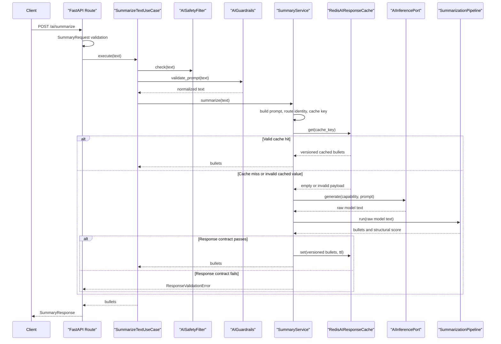

# 10 - Guardrails, Redis Cache, Response Pipeline, and Safe Error Handling

📌 GitHub Repository: [AI Engineer Foundation](https://github.com/aseemaggarwal89/ai-engineer-foundation)

In the previous blog, I explained provider abstraction, model registry, inference routing, fallback, retries, and circuit breakers.

That answered one important question:

```text
Which provider should execute the AI request?
```

This blog focuses on the reliability layer around that provider call.

The question now becomes:

```text
How should the backend control input, cache responses, validate model output,
and return safe errors?
```

This part of the project helped me understand that AI reliability is not one class or one decorator.

It is a workflow:

```text
request schema validation
-> keyword-based request safety check
-> prompt boundary checks and normalization
-> prompt construction
-> Redis cache lookup
-> provider inference
-> response parsing and validation
-> structural scoring
-> validated cache write
-> safe HTTP response
```

The goal is not to prove that the model is factually correct.

The goal is narrower and more backend-focused:

```text
Return predictable, contract-compliant application data.
```

## Verified Implementation Files

These are the main files involved in the summarization reliability flow:

```text
app/routers/routes/ai.py
app/application/ai/schemas/ai_summary.py
app/application/ai/usecases/summarize_text.py
app/application/ai/services/summary_service.py
app/application/ai/prompts/summary_prompt.py
app/application/ai/validator/request/ai_safety.py
app/application/ai/validator/request/ai_guardrails.py
app/application/ai/domain/ai_cache_port.py
app/application/ai/infrastructure/redis_ai_cache.py
app/application/ai/domain/ai_inference_port.py
app/application/ai/core/pipeline_registry.py
app/application/ai/domain/ai_pipeline_port.py
app/application/ai/core/summarization_pipeline.py
app/application/ai/core/bullet_parser.py
app/application/ai/validator/response/response_validator.py
app/application/ai/validator/response/hallucination_guard.py
app/application/ai/validator/response/response_scorer.py
app/domain/exceptions/exceptions.py
app/core/exception_handlers.py
app/core/exception_registry.py
```

The flow starts at:

```text
POST /ai/summarize
```

This endpoint is currently public in the project.

The FastAPI route stays thin:

```python
@public_router.post("/summarize", response_model=SummaryResponse)
async def summarize(
    request: SummaryRequest,
    use_case: SummarizeTextUseCase = Depends(get_summarize_use_case),
):
    bullets = await use_case.execute(request.text)
    return SummaryResponse(bullets=bullets)
```

The route owns HTTP mapping.

The use case owns the summarization application operation.

The service owns prompt, cache, inference, and response-processing behavior.

## Request Schema Validation

The request schema lives in:

```text
app/application/ai/schemas/ai_summary.py
```

The request model uses Pydantic constraints:

```python
SummaryText = Annotated[
    str,
    StringConstraints(
        strip_whitespace=True,
        min_length=1,
        max_length=20_000,
    ),
]
```

This means FastAPI/Pydantic rejects empty or oversized request text before the use case runs.

The unit here is character count, not token count.

That distinction matters.

Character limits are useful API boundaries, but they do not guarantee that a prompt fits every model's context window.

Token-aware limits are a future provider-routing concern.

## Use Case Boundary

The use case lives in:

```text
app/application/ai/usecases/summarize_text.py
```

Its current responsibility is:

```text
coordinate the summarization application operation
-> enforce request-side policy
-> apply the timeout boundary
-> delegate reusable summarization workflow to SummaryService
```

The use case is intentionally thin:

```python
@timeout_from_self
async def execute(self, text: str) -> list[str]:
    self.safety.check(text)
    text = self.guardrails.validate_prompt(text)

    return await self.summary_service.summarize(text)
```

This layer is still useful because it gives the application a clear operation boundary.

Later, authorization policy, tenant policy, audit decisions, or request-specific workflow controls can live here without moving HTTP logic into the service.

## Keyword-Based Request Safety

The request safety filter lives in:

```text
app/application/ai/validator/request/ai_safety.py
```

The class name is:

```text
AISafetyFilter
```

The current behavior is simple keyword matching.

It blocks these configured terms:

```python
BLOCKED_TERMS = {
    "credit card",
    "cvv",
    "password",
    "ssn",
}
```

Matching is:

- case-insensitive
- substring-based
- in-memory
- synchronous

If a blocked term appears, it raises:

```text
RequestValidationError
```

That maps to:

```text
HTTP 422
error_code = VALIDATION_ERROR
```

This is not complete PII detection.

It is not secret scanning.

It is not prompt-injection prevention.

It is a basic request-policy check used for learning the shape of an AI safety boundary.

This also means there can be false positives and false negatives.

For example:

```text
Explain password hashing
```

is educational, but the current keyword filter blocks it because it contains `password`.

On the other side, values like:

```text
4111 1111 1111 1111
123-45-6789
sk-test-secret-looking-value
```

are not detected unless they contain one of the blocked terms.

That limitation is documented intentionally.

## Prompt Boundary Checks and Normalization

Prompt guardrails live in:

```text
app/application/ai/validator/request/ai_guardrails.py
```

The method is:

```python
validate_prompt(text: str) -> str
```

The actual behavior is:

```text
trim leading and trailing whitespace
-> reject empty input
-> enforce a hard character limit
-> reject binary-like control-character-heavy input
-> remove unsafe control characters
-> normalize whitespace
-> apply a soft character limit
-> return normalized text
```

I am using precise wording here on purpose.

This is normalization and boundary enforcement.

It does not make a prompt safe from prompt injection.

It does not remove malicious instructions.

It does not guarantee factual model behavior.

## Hard Prompt Limit

The hard prompt limit comes from:

```text
AI__HARD_PROMPT_LIMIT
```

The default is defined in `AISettings`:

```python
hard_prompt_limit: int = 20_000
```

The unit is Python character count:

```python
if len(value) > HARD_LIMIT:
    raise PromptTooLargeError()
```

That maps to:

```text
HTTP 413
error_code = PROMPT_TOO_LARGE
```

This happens before prompt construction, cache lookup, or provider inference.

That is important because oversized input should not reach expensive downstream components.

## Soft Prompt Limit

The soft prompt limit comes from:

```text
AI__MAX_PROMPT_LENGTH
```

The default is:

```python
max_prompt_length: int = 8_000
```

If input is above the soft limit but below the hard limit, the project currently truncates by character count:

```python
if len(value) > SOFT_LIMIT:
    value = value[:SOFT_LIMIT]
```

This is a simple product decision for the learning project.

It controls cost and latency, but it has trade-offs:

- the summary may miss later content
- truncation can cut a sentence in the middle
- character count is not token count
- clients are not currently told that truncation happened
- large-document summarization deserves a better workflow

For production, I would consider sentence-aware truncation, token-aware truncation, chunked summarization, or a RAG/document workflow.

## Prompt Construction

The prompt builder lives in:

```text
app/application/ai/prompts/summary_prompt.py
```

The class is:

```text
SummaryPrompt
```

It has a prompt-template version:

```python
VERSION = "v1"
```

It builds provider-neutral summarization instructions:

```python
"Summarize the following text into EXACTLY 5 short bullet points.\n"
"Do not explain. Do not add extra text.\n\n"
f"Text:\n{text}"
```

Prompt construction is owned by the service workflow.

It is not duplicated in the route, use case, or provider adapter.

The prompt version matters because prompt changes affect output behavior.

That becomes important for caching.

## Redis Cache Port and Adapter

The cache abstraction lives in:

```text
app/application/ai/domain/ai_cache_port.py
```

The Redis adapter lives in:

```text
app/application/ai/infrastructure/redis_ai_cache.py
```

The adapter uses:

```text
redis.asyncio.Redis
```

The methods are async for Redis I/O:

```python
async def get(self, key: str)
async def set(self, key: str, value: str, ttl: int)
```

The Redis client is created once in the AI service container and closed during application shutdown.

That means the client is reused across requests instead of being created per request.

## Cache Key Composition

The cache key is built from behavior-affecting inputs:

```text
cache namespace
cache schema version
capability
routing-policy identity
prompt-template version and prompt text
temperature
max tokens
```

The raw value is hashed with SHA-256, so the final Redis key does not contain the raw prompt.

The final key shape is:

```text
ai_cache:{namespace}:v{schema_version}:{sha256_hash}
```

The namespace comes from:

```text
AI__CACHE_NAMESPACE
```

The default is:

```python
cache_namespace: str = "local"
```

This helps separate local, test, staging, and production cache keys.

It does not replace Redis access control or environment isolation.

## Cache Identity Under Fallback

This project now uses routing-policy cache identity.

That means the cache key represents the configured summarization route:

```text
primary provider and model
optional fallback provider and model
```

Example:

```text
primary=ollama:tinyllama;fallback=openai:gpt-4.1-mini
```

This is intentional.

For this learning implementation, the application treats eligible primary and fallback summarization outputs as interchangeable for the same configured route.

So if Ollama fails, OpenAI fallback succeeds, and the result passes validation, that response is cached under the route policy identity.

A production system may choose a different policy.

For example, it may cache by actual selected provider and model if provider-specific output differences, cost attribution, or evaluation history matter.

## Cache Payload Schema

Validated summaries are stored as a versioned JSON object:

```json
{
  "schema_version": 1,
  "bullets": ["..."]
}
```

The TTL comes from:

```text
AI__CACHE_TTL_SECONDS
```

The default is:

```python
cache_ttl_seconds: int = 3600
```

On cache hit, the service validates the cached payload before returning it.

It checks:

- valid JSON
- object payload
- compatible schema version
- non-empty bullet list
- every bullet is a non-empty string

If the cached value is malformed or obsolete, the service logs:

```text
ai_cache_invalid
```

Then it treats the cache value as a miss and continues to provider inference.

This avoids returning manually corrupted or old-format cache data.

## Cache Privacy

Hashing protects Redis key readability.

It does not anonymize cached values.

The cached payload still contains generated summary text.

That means production cache design still needs:

- Redis access controls
- environment isolation
- tenant or user isolation when required
- retention policy
- sensitive-request cache bypass rules
- encryption only when there is a clear key-management design

This project adds namespace and TTL controls, but it does not implement tenant-level cache isolation or encryption.

## Validated-Only Caching

The summary service caches only after the response pipeline accepts the output.

The flow is:

```text
provider response
-> parse and validate
-> structural score
-> threshold check
-> serialize validated bullets
-> write cache
```

Invalid provider output is not cached.

Low-scoring output is not cached.

Provider failures do not write cache entries.

This is one of the most important lessons in the project:

```text
Do not cache raw model output before validating the application contract.
```

## Response Pipeline

The response pipeline lives in:

```text
app/application/ai/core/summarization_pipeline.py
```

It implements:

```text
app/application/ai/domain/ai_pipeline_port.py
```

The method signature is:

```python
def run(self, raw_response: str) -> tuple[list[str], float]
```

It is synchronous because the current steps are lightweight in-memory parsing and checks.

The stages are:

```text
raw provider response validation
-> bullet parsing
-> parsed bullet validation
-> suspicious output length check
-> structural response scoring
-> bullets and score
```

Future stages such as external moderation, embedding comparison, LLM-as-judge, or retrieved-source verification may need async execution or background processing.

## Bullet Parser

The parser lives in:

```text
app/application/ai/core/bullet_parser.py
```

The implementation is intentionally simple:

```python
lines = [line.strip("-• ").strip() for line in text.splitlines()]
return [line for line in lines if line]
```

It handles simple hyphen bullets and bullet-character bullets.

It preserves line order.

It also treats plain non-empty lines as bullet items.

It does not parse full Markdown.

It does not specially handle numbered lists, nested bullets, multiline bullets, or code blocks.

That is acceptable for the current prompt contract because the model is instructed to return exactly five short bullet points.

## Response Validation

The response validator lives in:

```text
app/application/ai/validator/response/response_validator.py
```

Raw response validation checks:

- empty output
- suspiciously short output
- common prompt-leakage phrase
- malformed code-fence-heavy output

Parsed bullet validation checks:

- empty bullet list
- common prompt-leakage phrase inside bullets
- maximum returned bullet count

The current implementation clamps bullets to five:

```python
return bullets[:5]
```

This keeps the public response predictable.

The prompt also asks for exactly five short bullet points.

There is currently no strict minimum bullet count after parsing.

## Suspicious Output Length Guard

The class is currently named:

```text
HallucinationGuard
```

The name is broader than what it currently does.

The current implementation checks output shape and length:

```python
MAX_BULLET_LENGTH = 300
```

If any bullet is longer than that, the output is rejected with:

```text
ResponseValidationError
```

This is not factual hallucination detection.

It does not verify truth.

It is a suspicious-output length guard and an extension point for future groundedness checks.

## Structural Response Scoring

The scorer lives in:

```text
app/application/ai/validator/response/response_scorer.py
```

The class is:

```text
AIResponseScorer
```

The current score is structural.

It looks at:

- whether bullets exist
- average bullet length
- whether at least five bullets exist

The summary service applies a threshold:

```python
if score < self.threshold:
    raise ResponseValidationError(
        "AI output did not satisfy the summary response contract"
    )
```

This is not a factual quality score.

It is a response-shape conformance check.

## Validation Failure Behavior

If model output fails the response pipeline, the current behavior is:

```text
ResponseValidationError
-> no cache write
-> centralized exception handler
-> safe HTTP 502 response
```

The system does not currently:

- retry the same provider after response-validation failure
- invoke fallback after response-validation failure
- repair malformed model output
- run an LLM-as-judge

Those may be future improvements, but they are not implemented in this flow.

## Safe Error Handling

Application exceptions live in:

```text
app/domain/exceptions/exceptions.py
```

Important AI and validation exceptions:

| Exception | HTTP status | Error code |
| --- | ---: | --- |
| `RequestValidationError` | 422 | `VALIDATION_ERROR` |
| `PromptTooLargeError` | 413 | `PROMPT_TOO_LARGE` |
| `AIProviderError` | 502 | `AI_PROVIDER_ERROR` |
| `ResponseValidationError` | 502 | `INVALID_AI_RESPONSE` |
| `ServiceError` | 500 | `SERVICE_ERROR` |

Global handlers are registered in:

```text
app/core/exception_registry.py
```

The standard application error response is:

```json
{
  "error_code": "INVALID_AI_RESPONSE",
  "message": "AI output did not satisfy the summary response contract"
}
```

The current response contract does not include request ID in the body.

Request IDs are used in logging context elsewhere in the application.

## Logging Boundaries

The reliability layer logs operational metadata such as:

```text
ai_cache_hit
ai_cache_miss
ai_cache_invalid
ai_inference_response_received
```

The service logs capability and response length metadata.

It does not log raw prompts or full raw provider responses in this summarization flow.

That boundary matters.

Safe errors do not give permission to log sensitive content.

Production logs should prefer:

- request ID
- capability
- provider
- model
- cache status
- input length
- output length
- validation stage
- structural score
- latency
- error category

They should avoid:

- raw prompts
- raw model responses
- bearer tokens
- API keys
- Redis credentials
- database credentials

## Debugging Scenarios

### Prompt Is Too Large

Symptom:

```text
HTTP 413
error_code = PROMPT_TOO_LARGE
```

Likely source:

```text
AIGuardrails.validate_prompt(...)
```

What to check:

- `AI__HARD_PROMPT_LIMIT`
- request schema max length
- input character count
- whether the request should become a chunked or RAG workflow

### Keyword Safety Rejection

Symptom:

```text
HTTP 422
error_code = VALIDATION_ERROR
message = Sensitive data detected
```

Likely source:

```text
AISafetyFilter.check(...)
```

What to check:

- exact blocked terms
- substring match behavior
- false positives such as educational text
- whether future redaction or stronger detection is needed

### Cache Hit

Symptom in logs:

```text
ai_cache_hit
```

Likely source:

```text
SummaryService.summarize(...)
```

What to check:

- same normalized input
- same prompt version
- same route policy identity
- same temperature
- same max tokens
- same cache schema version
- same cache namespace

### Invalid Cache Value

Symptom in logs:

```text
ai_cache_invalid
ai_cache_miss
```

Likely source:

```text
SummaryService._load_cached_bullets(...)
```

What to check:

- malformed JSON
- old schema version
- empty bullet list
- manually modified Redis value
- deployment using incompatible cache schema

### Invalid AI Response

Symptom:

```text
HTTP 502
error_code = INVALID_AI_RESPONSE
```

Likely sources:

```text
AIResponseValidator
HallucinationGuard
AIResponseScorer
SummaryService threshold check
```

What to check:

- raw output length metadata
- prompt instructions
- model behavior
- parser expectations
- max token setting
- structural score threshold

## Sequence Diagram



## Responsibility Table

| Component | Responsibility |
| --- | --- |
| `SummaryRequest` | Validates request text shape with Pydantic |
| `SummarizeTextUseCase` | Coordinates the summarization application operation |
| `AISafetyFilter` | Applies basic keyword-based request-policy checks |
| `AIGuardrails` | Enforces prompt boundaries and normalization |
| `SummaryPrompt` | Constructs versioned summarization instructions |
| `SummaryService` | Coordinates prompt, cache, inference, and response processing |
| `AIResponseCachePort` | Defines provider-independent cache operations |
| `RedisAIResponseCache` | Builds hashed keys and stores cache values in Redis |
| `AIInferencePort` | Defines provider-independent inference behavior |
| `PipelineRegistry` | Selects a response pipeline by capability |
| `SummarizationPipeline` | Parses and validates summarization output |
| `BulletParser` | Converts model text into application-owned bullet data |
| `AIResponseValidator` | Enforces structural output checks |
| `HallucinationGuard` | Currently rejects suspiciously long bullets |
| `AIResponseScorer` | Measures response-shape conformance |
| Exception handlers | Convert application errors into safe HTTP responses |

## Implemented Controls

Currently implemented:

- Pydantic request text constraints
- keyword-based request safety filter
- hard prompt character limit
- soft prompt character truncation
- binary-like control-character rejection
- whitespace normalization
- versioned prompt builder
- Redis cache key hashing
- cache namespace
- cache schema version
- cache TTL setting
- cached-value validation before return
- validated-only cache write
- response parsing
- structural response validation
- suspicious output length check
- structural scoring threshold
- centralized application exception mapping

## Known Limitations

The current implementation does not provide:

- complete PII detection
- secret scanning
- prompt-injection prevention
- token-aware prompt limits
- sentence-aware truncation
- tenant-level cache isolation
- cache encryption
- selected-provider cache identity
- factual hallucination detection
- groundedness validation
- automatic response repair
- fallback after response-validation failure
- response-pipeline metrics for every stage

These are not hidden.

They are future production improvements.

## Production Considerations

For a production AI backend, I would improve this layer with:

- real PII and secret detection
- redaction options before rejection
- per-tenant AI policy
- local-only versus cloud-allowed request classification
- token-aware input budgeting
- chunked or hierarchical summarization for long documents
- RAG-grounded validation
- explicit selected-provider metadata
- cache isolation by tenant or user when needed
- provider usage and cost metadata
- response schema versioning across all AI capabilities
- cache corruption counters
- response-validation failure metrics
- total inference budget across retry and fallback

The project is intentionally smaller than that.

But the boundaries are useful because each one can evolve independently.

## What I Learned

The biggest lesson from this part of the project is:

```text
AI reliability is a workflow, not a single model call.
```

The backend has to decide:

```text
What input is allowed?
How much input is allowed?
What prompt should be sent?
Can an existing validated result be reused?
Does the model output match the API contract?
Should the result be cached?
What safe error should the client receive?
```

This changed how I think about AI integration.

Calling a model is only the middle of the workflow.

The real backend engineering work is everything around that call.

## Next

Next, I will explain logging, tracing, observability, and production readiness for AI backends.
